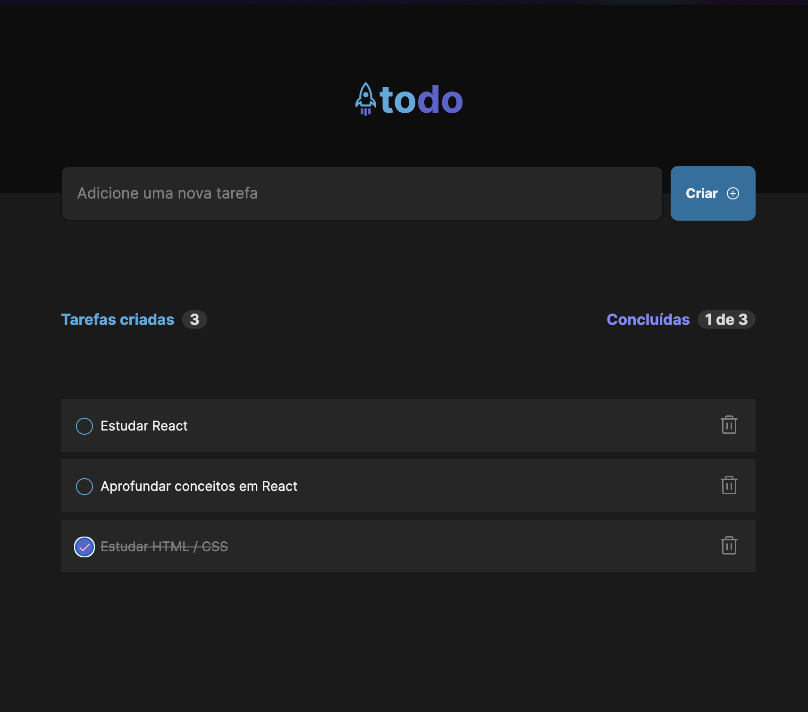

<p align="center">
  
</p>


# ToDo tasks

Esse projeto foi desenvolvido para o desafio do curso react da Rocketseat. Trata-se de um todo list, onde pode criar tarefas, marcar como concluídas e deletar.


## Começar

Para iniciar o projeto, comece instalando as dependências

```bash
  npm install
```

## Executar

Para iniciar o projeto, execute

```bash
  npm run dev
```

## Stack utilizada

- Vite
- React
- TailwindCSS
- phosphor-icons